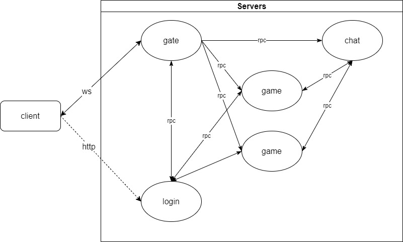

# game server cluster

## Layouts

```bash
cluster_game
├─assets                资源目录: 服务器配置,服务器数据,通信协议,配置表等
├─build                 项目构建脚本: dockerfile,deploy.sh等
├─cmd                   项目入口
├─chat                  聊天服务器
├─game                  游戏服务器
├─gate                  网关服务器
├─login                 登录服务器
├─pkg                   公共包
├─protos                通信协议
├─settings              配置表
├─main.go
├─Makefile
├─go.mod
└─README.md
```

## Servers



## Requirements

> 需求清单：
> 1. 客户端通过`login`服进行注册/登录
> 2. 客户端登录成功后，获取服务器列表
> 3. 客户端选择`game`服进入游戏（默认进入最近登录过的`game`器或最新开服的`game`服）
> 4. 如果用户在`game`服中没有角色，则自动创建一个角色；否则自动使用之前的角色（用户在一个`game`服只能创建一个角色）
> 5. `game`服业务：实现用户信息获取(Get)和位置信息同步(Push)
> 6. 客户端通过`chat`服实现聊天，支持私聊、单服聊天、跨服聊天

## Development

### 登录/注册

#### 登录
- 接口: `/login`
- 协议: `http`
- 参数: `dto.ReqLogin` 用户名/密码
- 返回: `dto.RespLogin` 返回状态码、token、`gate`服地址
- 说明: 账号登录

#### 注册
- 接口: `/reg`
- 协议: `http`
- 参数: `dto.ReqReg` 用户名/密码
- 返回: `dto.RespReg` 返回状态码、token、`gate`服地址
- 说明: 账号注册

#### 获取服务器列表
- 接口: `/severlist`
- 协议: `http`
- 参数: 无 (携带Token请求)
- 返回: `dto.RespServerList` 返回状态码、`game`服列表（含角色信息）
- 说明: 获取服务器列表，包含当前用户的角色信息

### 游戏

### 进入游戏
- 接口: `game.handler.entry`
- 协议: `ws`
- 方法: `Request`
- 参数: `dto.ReqGameEntry` 登录信息
- 返回: `dto.RespGameEntry` 校验信息
- 说明: 进入游戏服的第一个消息

### 角色信息
- 接口: `game.handler.playerinfo`
- 协议: `ws`
- 方法: `Request`
- 返回: `dto.PlayerInfo`
- 说明: 获取角色信息

### 做任务
- 接口: `game.handler.dotask`
- 协议: `ws`
- 方法: `Notify`
- 参数: `taskID`
- 说明: 做任务

### 角色升级
- 接口: `game.push.playerupdate`
- 协议: `ws`
- 方法: `Push`
- 返回: `dto.PlayerUpdateInfo`
- 说明: 角色升级信息

### 聊天

- 接口: `chat.handler.entry`
- 协议: `ws`
- 方法: `Request`
- 参数: `dto.ReqChatEntry` 登录信息
- 返回: `dto.RespChatEntry` 校验信息
- 说明: 进入聊天服的第一个消息

### 发送消息
- 接口: `chat.handler.send`
- 协议: `ws`
- 方法: `Notify`
- 参数: `dto.ChatMessage`
- 说明: 发送消息

### 收到消息
- 接口: `chat.push.message`
- 协议: `ws`
- 方法: `Push`
- 参数: `dto.ChatMessage`
- 说明: 收到消息

## Process

### 登录游戏流程
1. 玩家通过 `login`服 登录，如果账号不存在，则自动注册一个
2. 登录成功后，返回 token 和 `gate`服地址 给客户端
3. 客户端携带token向`login`服请求 游戏服列表（ServerList）；服务器返回 ServerList（如果用户创建过角色，则包含已创建的角色信息）
4. 客户端向`gate`服发起websocket连接请求，在`HandshakeData`里携带 token和key 信息
5. 在gate服的`HandshakeValidator`里校验token和key
6. ws连接成功后，请求 `game.handler.playerInfo` 获取用户角色信息(无角色就自动创角)
7. 返回用户角色信息（playerInfo）
